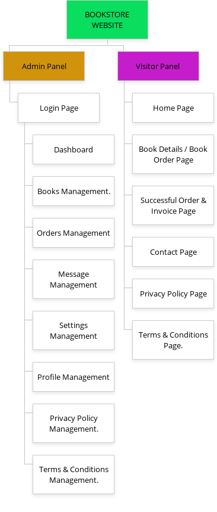
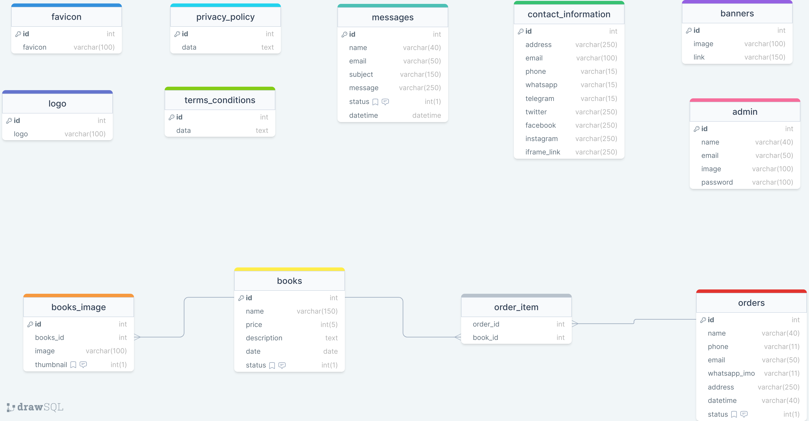

# bookstore

a simple bookstore management website

---

<a href="http://nibrash.liveblog365.com/books_store/" target="_blank">visitor panel live ink</a>

---
<a href="http://nibrash.liveblog365.com/books_store/admin" target="_blank">admin panel live ink</a>

---

### Version Requirment

---

- php >= 8.1.2
- phpmyadmin >= 5.1.1

---

## Installation Proccess

---
- [ ] Step - 1  

[Download the Project](https://github.com/code-with-Rashed/bookstore/archive/refs/heads/master.zip)  

- [ ] Step - 2  

Creaate a database like : <strong>bookstore</strong>  

### Export sql file in your (bookstore) database
- To open the sql folder. 
- choose/copy the bookstore.sql file. 
- then export in your database. 


- [ ] Step - 4 

### Set Environment Variables  
- To open the Configuration/env.php file.  
- You have to fill in your app url , app folder , database credentials and time zone.  
For Example...  

```php 
//application information
$APP_URL = "http://localhost/bookstore";
$APP_FOLDER = "/bookstore";
//-----------------------

//mysql database information
$MSDB_HOST = "localhost";
$MSDB_PORT = 3306;
$MSDB_USERNAME = "root";
$MSDB_PASSWORD = "";
$MSDB_NAME = "bookstore";
//--------------------------

// set default timezone
$DEFAULT_TIMEZONE = "Asia/Dhaka";
//---------------------
```

### Admin login details
Email : admin@gmail.com  
Password : admin

### bookstore requirement sitemap 

 

### bookstore database diagram

